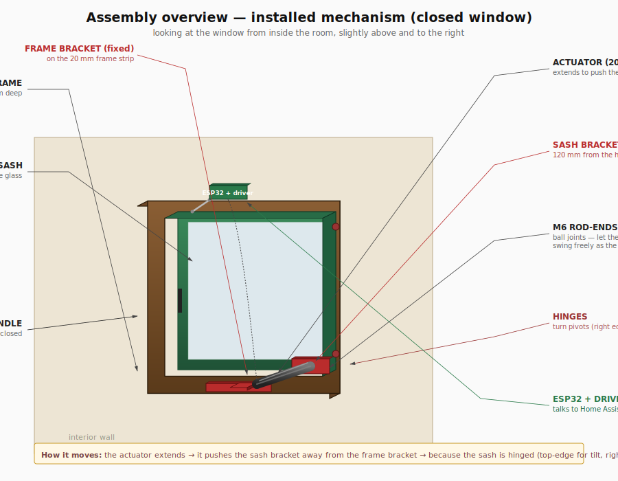

# How it works — visual walkthrough

This page is the "I just want to picture the thing" guide. The other docs are the source of truth, this one is the orientation map.

## The 30-second version

You bolt **two small brackets** to the top of the window — one to the **frame** (which doesn't move), one to the **sash** (the part that swings). A **12 V linear actuator** stretches between them like an arm. When the actuator extends, it pushes the sash open. When it retracts, it pulls the sash closed. An ESP32 nearby drives the actuator and talks to Home Assistant.

That's the whole mechanism. Everything else is detail.

## The pieces

There are only six things to get straight in your head:

| Piece | What it is | Where it lives |
|---|---|---|
| **The frame** | Doesn't move. The fixed border of the window. | Built into the wall. |
| **The sash** | Moves. Holds the glass. | Inside the frame opening; protrudes 20 mm into the room. |
| **Frame bracket** | Small 3D-printed plate (red in the diagrams) | Glued + screwed to the **room-side face of the frame**, top-middle. |
| **Sash bracket** | Same idea, slightly different shape | Glued + screwed to the **room-side face of the sash**, near the hinge (120 mm from the right edge). |
| **Actuator** | A 200 mm 12 V motorised piston. | Hangs horizontally between the two brackets, just in front of the top of the window. |
| **ESP32 box** | The brains | Mounted on the frame near the fixed bracket. Wires go to the actuator and to a 12 V power supply. |

## How the brackets connect to the actuator

Each bracket holds an **M6 rod-end** — a small ball-joint. The actuator's two ends bolt onto these rod-ends. Because both ends of the actuator can pivot freely (that's what "ball joint" means), the actuator can swing through the wide arcs that tilt and turn require without binding.

Picture it like an arm with shoulder joints at both ends.

## How tilt works

1. You turn the window handle to the **tilt** position.
2. The handle releases the side latches but keeps the bottom hinged.
3. From Home Assistant (or an automation), you say "tilt 50%".
4. The ESP32 commands the actuator to extend partway.
5. The actuator pushes the sash bracket forward.
6. Because the sash is hinged at the bottom, the **top of the sash swings inward** into the room — exactly like the photo you sent.

To close: the actuator retracts, pulls the sash back to flush, the gravity in the seal does the rest.

## How turn works

Same actuator, same brackets, different latch position on the handle:

1. You turn the window handle to the **turn** position (handle points sideways).
2. The handle releases the bottom hinge and engages the side hinges.
3. From Home Assistant, "turn 80%".
4. The actuator extends.
5. The sash bracket is near the hinge side, so a relatively short extension at that point swings the **opposite (handle) side of the sash into the room**, like opening a door.

The same actuator stroke does both because both anchor points were chosen carefully (`docs/geometry.svg` has the math) so neither anchor sits on a pivot axis. If either did, the actuator would jam in that mode.

## The most important constraint

The frame bracket has only **20 mm of frame face** to grab onto, because the sash protrudes 20 mm forward of the frame and covers everything below that strip. The bracket plate is therefore short and wide — 190 × 18 mm — and uses a **compressible tab** at the top that wedges against the ceiling during install. The sash bracket has the entire sash face to work with, so it's a bigger, simpler plate.

See:
- [`mounting-detail.svg`](mounting-detail.svg) — the frame bracket in cross-section
- [`mounting-detail-sash.svg`](mounting-detail-sash.svg) — the sash bracket in cross-section
- [`geometry.svg`](geometry.svg) — three views (front, tilt, turn) showing the macro layout

## How to read the existing diagrams

| Diagram | Drawing convention | Why it looks weird |
|---|---|---|
| `geometry.svg` panel 1 (Front) | Like a photo of the window from inside the room | This is the "normal" view — actuator is the diagonal grey bar |
| `geometry.svg` panel 2 (Tilt) | Vertical slice through the side, the wall is on the left | The actuator looks short because it's been rotated downward as the sash tilted |
| `geometry.svg` panel 3 (Turn) | View from above, looking down | The window opens away from the wall, into the room (downward in the diagram) |
| `mounting-detail.svg` | Vertical slice cut sideways through the top of the frame | "Outside" is on the left, "room" is on the right — the actuator body extends out of the page |
| `mounting-detail-sash.svg` | Same as above, but cut through where the sash bracket lives | The actuator body extends out of the page, going toward the fixed bracket |

## Order of build

Once parts arrive, the build order is:

1. **Bench-test the electronics first.** ESP32 + driver + actuator on the desk, no window. Confirm Home Assistant sees `cover.window_opener` and that "open" / "close" / "set position" actually move the actuator. (This is Phase 1 in `PLAN.md`.)
2. **Print both brackets** from `mechanical/cad/*.scad`. Tap the M6 holes.
3. **Dry-fit on the window.** Tape the brackets in position before any glue or screws — measure twice, drill once.
4. **Mount the actuator.** Screw the rod-ends onto the actuator first, then onto the brackets.
5. **Tilt-only first.** Run a few full tilt cycles before trying turn — turn has more inertia and a wider error margin.
6. **Calibrate.** `docs/calibration.md` covers this.
