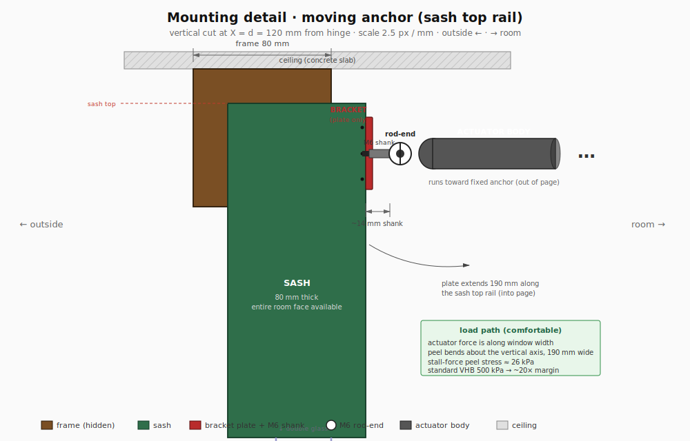
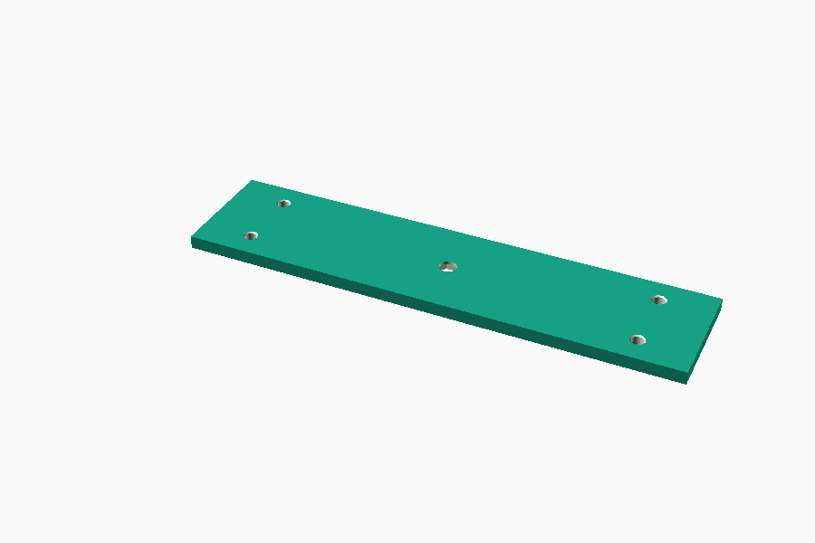
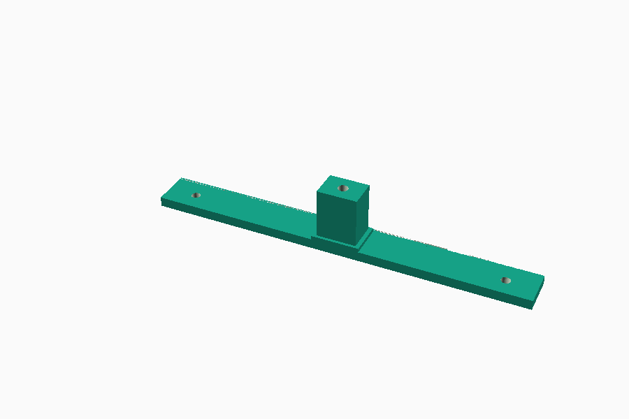
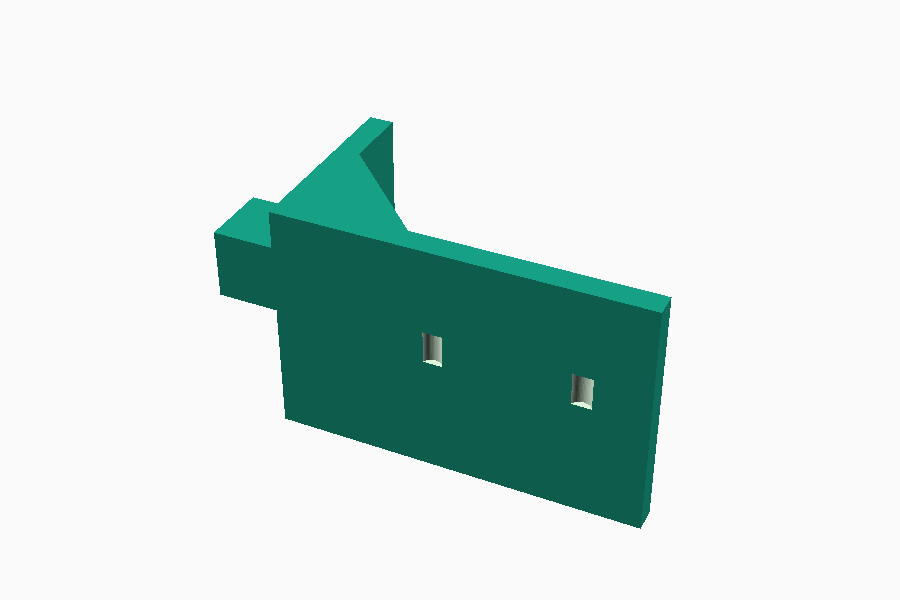
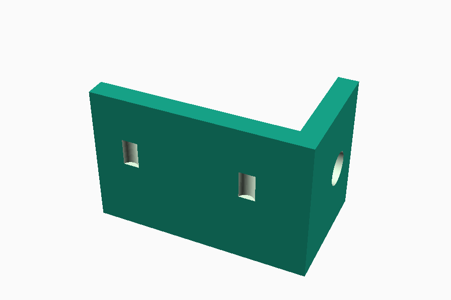
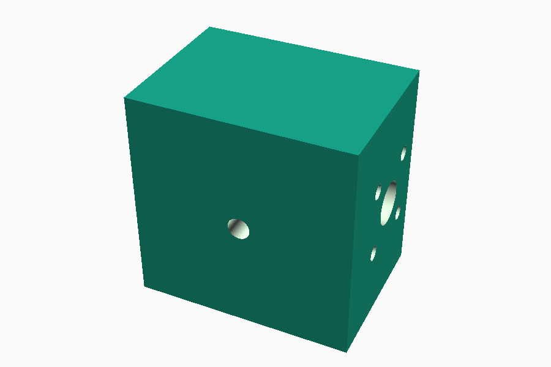

# Mechanical design

The mechanical design is the load-bearing part of this project — the firmware only works if the geometry works. Read this before opening CAD.

## Mounting geometry

The target window (see `docs/window-spec.md`) is a European tilt-and-turn, 845 × 1325 mm, hinge on the **right**, handle on the **left**. The actuator is mounted horizontally across the top of the window:

- **Fixed end** at the **top-middle of the frame** (`x = W/2 = 422.5 mm` from the left jamb), on `cad/frame-bracket.FCStd`.
- **Moving end** on the **top edge of the sash**, `d = 120 mm` from the hinge side (`cad/sash-bracket.FCStd`).
- Both ends use **M6 or M8 ball-joint rod ends** so the actuator can swing vertically (tilt) and horizontally (turn) without binding.

### Fixed-end mounting detail

The fixed-end bracket bolts to the **room-side (inside) face of the top frame rail**, not above the frame. The actuator body hangs in the room at roughly the height of the top of the window, with no interference from the ~20 mm ceiling gap above the frame.

Both brackets are **190 mm wide** along the window length (into the page of the side cross-sections). That width sets the VHB + screw area available to resist torque from the actuator.

**Fixed-end bracket (top-middle of frame):**

- Hard constraint — only 20 mm of frame face is accessible. The sash covers the frame's inside face everywhere except a 20 mm strip between the sash top and the ceiling.
- The **frame top touches the ceiling** (no air gap above the frame), so there is nowhere to hook over. Mounting has to live in the 20 mm strip itself.
- **Load is comfortable.** Actuator force is along the window width, so peel bending is about the vertical axis across the full 190 mm plate width — not across the 18 mm plate height. Peel stress at stall ≈ 140 kPa, well inside standard VHB's 500 kPa limit (~3× margin).
- The `cad/frame-bracket.scad` bracket includes a 2 mm **ceiling-jam tab** at the top edge. It is an **install aid and a passive peel-resist** for edge cases (VHB aging, assembly errors) — *not* a primary load path. When the bracket is pushed up during install, the tab compresses slightly against the ceiling and holds the bracket in place while the VHB sets and screws go in.
- Load path: VHB (primary, shear + peel) → 2× M4 self-tappers into PVC (backup).
- Install: press the bracket up into the 20 mm strip (tab compresses), then screw in from the room side.

**Sash-end (moving) bracket — `docs/mounting-detail-sash.svg`:**

- The sash's room-side face is 20 mm proud of the frame, so the *entire* sash top rail is accessible.
- Plate is 190 × ~42 mm (~8000 mm²). Stall-force tensile stress ~160 kPa — 3× margin below VHB's limit. **No hook needed.**
- The 20 mm sash lip already provides most of the standoff the fixed-end bracket gets from its arm. The M6 rod-end shank threads directly through the plate; a nut on the sash side locks it. No separate arm geometry.
- Load path: VHB (primary) → 3× M4 self-tappers into the sash top rail.
- Install: peel-off VHB backing, press on, screw in. Much simpler than the fixed end.

### Why this geometry works for both modes

For an actuator to drive a rotation, neither endpoint can sit on the rotation axis — otherwise the distance between the two endpoints stays constant during rotation, and the actuator can't change the angle.

| Endpoint | On tilt axis (bottom edge)? | On turn axis (right edge)? |
|---|:-:|:-:|
| Fixed: top-middle of frame `(W/2, 0)` | off | off |
| Moving: top of sash, 120 mm from hinge `(W-120, 0)` | off | off |

Both endpoints are off both axes, so extending the actuator drives the sash open in whichever mode the handle has selected.

### Stroke–angle map (with d = 120 mm)

| State | Distance | Stroke |
|---|---:|---:|
| Closed | 302.5 mm | 0 |
| Full tilt (7°, scissor stop) | 343.1 mm | 40.6 mm |
| Full turn (90°) | 439.2 mm | 136.7 mm |
| Full turn (100°, hardstop margin) | 458.8 mm | 156.3 mm |

Target actuator: **200 mm stroke, ≥ 500 N force, 12 V DC.** Force is dominated by the turn-mode moment arm (`d = 120 mm`); tilt is gravity-assisted and needs < 20 N.

## Mode asymmetry — important

Full tilt sits at ~26% of stroke; full turn at ~78%. The same `cover.position = 50` means different window angles in the two modes. The firmware exposes raw **stroke %**; per-mode semantics live in Home Assistant (see `docs/architecture.md`). If you ever add a handle-position sensor, the firmware can remap to clean per-mode percentages — noted in `PLAN.md`.

## Ball-joint rod ends are required

In tilt mode the moving end traces a short arc around the bottom edge. In turn mode the same point traces a wide arc around the hinge side — a different plane. The actuator body must be free to swing in **two axes** at each end. Use **M6 or M8 rod-end (heim) joints** at both ends. Fixed pivots or single-axis hinges will bind in one mode, usually turn.

## Bracket design notes

- **Print in PETG or ABS**, not PLA — summer sun on the frame easily exceeds PLA's glass-transition temperature.
- Brackets mount with **VHB double-sided tape** as a reversible baseline; add self-tapping screws only after placement is confirmed (drilling into a PVC window is irreversible).
- The **tilt stay** (scissor visible in the top-left of `docs/window-photo.jpg` for the target window) lives on the handle side — keep brackets clear of its travel.
- The fixed-end bracket is on the top rail of the frame, centered. Leave ~20 mm clearance above so the actuator body can pivot up (retract side) and down (extend side) as the sash tilts.
- The sash bracket sits on the top rail of the sash, 120 mm inboard from the hinge. In turn mode it swings outward into the room; confirm nothing on the room side (curtains, blinds, shelves) is in the 90° arc.

## CAD files

- `cad/common.scad` — shared parameters (window dims, KP08 / Prusa-nut / NEMA17 dimensions).
- `cad/sash-bracket.scad` — moving-end window bracket, 120 mm from the hinge on the sash top rail.
- `cad/frame-bracket.scad` — fixed-end window bracket, top-middle of the frame.
- `cad/rig-motor-mount.scad` — lead-screw rig: motor + KP08 #1 + frame-side rod-end mount.
- `cad/rig-far-bearing.scad` — lead-screw rig: KP08 #2 holder at the far end.
- `cad/rig-carriage.scad` — lead-screw rig: Prusa-nut + LH rod-end carriage that slides on the screw.
- `cad/README.md` — install / render / print instructions.
- `stl/*.stl` and `stl/*.png` — exported printable STLs and preview renders.

### Window-side brackets

| Bracket | Preview |
|---|---|
| Sash bracket (flat plate, 4 corner M4 + central M6 + back-face hex pocket) |  |
| Frame bracket (plate + arm + ceiling-jam tab) |  |

### Lead-screw rig (the "DIY linear actuator" between the two brackets)

| Part | Preview |
|---|---|
| Motor mount + KP08 #1 holder + rod-end tab |  |
| Far-end bearing block |  |
| Carriage (holds Prusa nut + LH rod-end) |  |

The rig is a self-contained linear-actuator equivalent: NEMA17 at one end drives the lead screw through KP08 #1, the screw extends to KP08 #2 at the far end, and the carriage rides along the screw via the Prusa nut. An 8 mm smooth steel rod runs parallel to the screw at a 30 mm offset to prevent the carriage from rotating with the screw — the carriage has a clearance hole through it for that rod. The motor-end of the rig has a rod-end tab that mounts to the frame bracket, and the carriage has its own rod-end mount on the bottom that connects to the sash bracket.

**Critical: rig CAD uses placeholder dimensions for the KP08 and Prusa nut at the top of `cad/common.scad`.** Verify with calipers before printing — those parts vary between manufacturers. Re-render after any `.scad` change.

Enclosure (`cad/esp32-enclosure.scad`) is not yet modelled — comes after the electronics bring-up in Phase 1.
