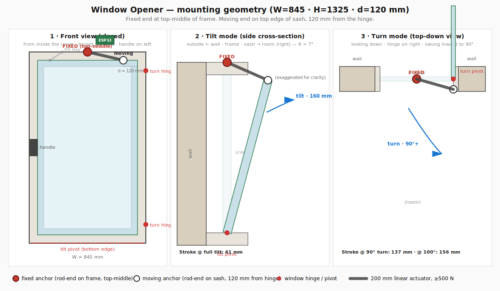
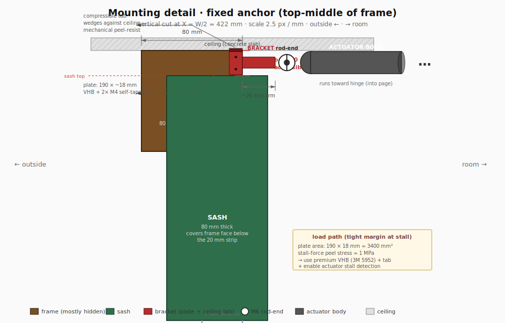

# Mechanical design

The mechanical design is the load-bearing part of this project — the firmware only works if the geometry works. Read this before opening CAD.

## Mounting geometry

The target window (see `docs/window-spec.md`) is a European tilt-and-turn, 845 × 1325 mm, hinge on the **right**, handle on the **left**. The actuator is mounted horizontally across the top of the window:

- **Fixed end** at the **top-middle of the frame** (`x = W/2 = 422.5 mm` from the left jamb), on `cad/frame-bracket.FCStd`.
- **Moving end** on the **top edge of the sash**, `d = 120 mm` from the hinge side (`cad/sash-bracket.FCStd`).
- Both ends use **M6 or M8 ball-joint rod ends** so the actuator can swing vertically (tilt) and horizontally (turn) without binding.

### Fixed-end mounting detail

The fixed-end bracket bolts to the **room-side (inside) face of the top frame rail**, not above the frame. The actuator body hangs in the room at roughly the height of the top of the window, with no interference from the ~20 mm ceiling gap above the frame.

**Hard constraint — only 20 mm of frame face is accessible.** The sash covers the frame's inside face everywhere except a 20 mm strip between the sash top and the ceiling. That's the entire mounting surface.

**Bracket design consequence:** the mounting plate is small (~18 mm tall × 80–100 mm wide along the frame), so relying on screws + VHB alone in the stall-force case is marginal. The bracket adds a **hook that extends over the top edge of the frame** into the ~20 mm gap to the ceiling — see `docs/mounting-detail.svg`. The hook doesn't have to attach to the ceiling; it just mechanically prevents the bracket from rotating out if the VHB peels. Load path: VHB (primary) → M4 self-tappers (backup) → frame-top hook (failsafe).

**Attachment:** 2× M4 self-tapping screws through the mounting plate into the PVC frame, plus VHB double-sided tape full-contact behind the plate. The hook over the frame top is a passive mechanical catch — no additional fixings.

**Sash-end bracket:** uses the same pattern but mounts on the **room-side face of the sash top rail** (which is already 20 mm proud of the frame, so there is plenty of accessible sash face to work with). Its arm extends a shorter distance (~10–15 mm) because the sash itself already provides the 20 mm of standoff.

### Why this geometry works for both modes

For an actuator to drive a rotation, neither endpoint can sit on the rotation axis — otherwise the distance between the two endpoints stays constant during rotation, and the actuator can't change the angle.

| Endpoint | On tilt axis (bottom edge)? | On turn axis (right edge)? |
|---|:-:|:-:|
| Fixed: top-middle of frame `(W/2, 0)` | off | off |
| Moving: top of sash, 120 mm from hinge `(W-120, 0)` | off | off |

Both endpoints are off both axes, so extending the actuator drives the sash open in whichever mode the handle has selected.

### Stroke–angle map (with d = 120 mm)

| State | Distance | Stroke |
|---|---:|---:|
| Closed | 302.5 mm | 0 |
| Full tilt (7°, scissor stop) | 343.1 mm | 40.6 mm |
| Full turn (90°) | 439.2 mm | 136.7 mm |
| Full turn (100°, hardstop margin) | 458.8 mm | 156.3 mm |

Target actuator: **200 mm stroke, ≥ 500 N force, 12 V DC.** Force is dominated by the turn-mode moment arm (`d = 120 mm`); tilt is gravity-assisted and needs < 20 N.

## Mode asymmetry — important

Full tilt sits at ~26% of stroke; full turn at ~78%. The same `cover.position = 50` means different window angles in the two modes. The firmware exposes raw **stroke %**; per-mode semantics live in Home Assistant (see `docs/architecture.md`). If you ever add a handle-position sensor, the firmware can remap to clean per-mode percentages — noted in `PLAN.md`.

## Ball-joint rod ends are required

In tilt mode the moving end traces a short arc around the bottom edge. In turn mode the same point traces a wide arc around the hinge side — a different plane. The actuator body must be free to swing in **two axes** at each end. Use **M6 or M8 rod-end (heim) joints** at both ends. Fixed pivots or single-axis hinges will bind in one mode, usually turn.

## Bracket design notes

- **Print in PETG or ABS**, not PLA — summer sun on the frame easily exceeds PLA's glass-transition temperature.
- Brackets mount with **VHB double-sided tape** as a reversible baseline; add self-tapping screws only after placement is confirmed (drilling into a PVC window is irreversible).
- The **tilt stay** (scissor visible in the top-left of `docs/window-photo.jpg` for the target window) lives on the handle side — keep brackets clear of its travel.
- The fixed-end bracket is on the top rail of the frame, centered. Leave ~20 mm clearance above so the actuator body can pivot up (retract side) and down (extend side) as the sash tilts.
- The sash bracket sits on the top rail of the sash, 120 mm inboard from the hinge. In turn mode it swings outward into the room; confirm nothing on the room side (curtains, blinds, shelves) is in the 90° arc.

## CAD files (not yet modelled — Phase 2)

- `cad/frame-bracket.FCStd` — fixed-end bracket, top-middle of the frame.
- `cad/sash-bracket.FCStd` — moving-end bracket, 120 mm from the hinge on the sash top rail.
- `cad/esp32-enclosure.FCStd` — ESP32 + driver + buck enclosure, mounts on the frame near the fixed anchor.
- `stl/` — exported printable STLs. Re-export after any `.FCStd` change.
